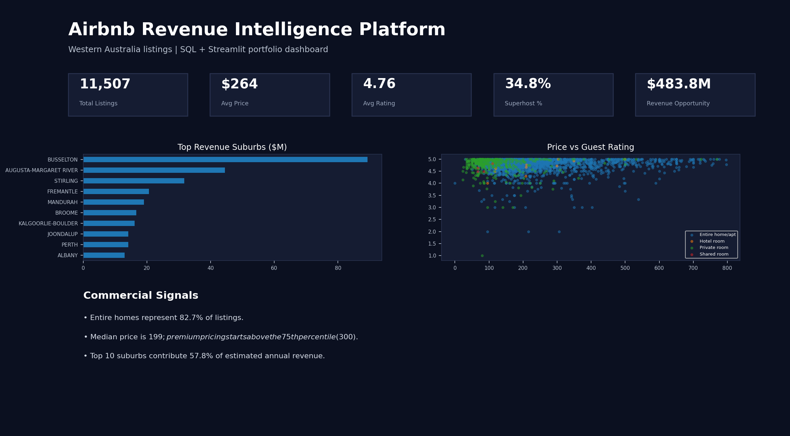
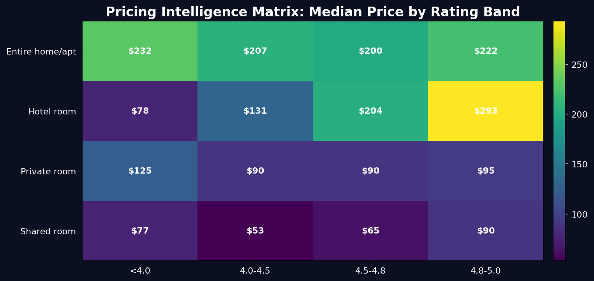
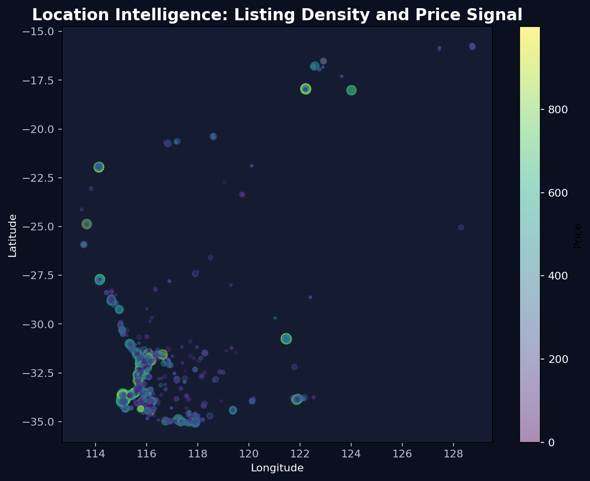

# Airbnb Revenue Intelligence Platform

A SQL + analytics project built from an Airbnb Western Australia listings dataset. This project upgrades a beginner SQL case study into a commercial revenue intelligence platform for pricing, host performance, suburb opportunity analysis, and storytelling.

## Business Problem

Airbnb operators and marketplace analysts need to understand where revenue is concentrated, which suburbs are becoming competitive, how price relates to guest ratings, and where listings can grow without hurting occupancy.

This project answers those questions using SQL modelling, KPI views, advanced analysis, and an interactive Streamlit dashboard.

## Dataset

- Source inspiration: Medium SQL project shared by the user
- Dataset file: `airbnb_wa.csv`
- Records: **11,507 listings**
- Columns: **75 raw fields**
- Geography: Western Australia Airbnb listings

## Dashboard Preview

### Executive Dashboard


### Pricing Intelligence


### Location Intelligence


## Project Structure

```text
airbnb_revenue_intelligence/
├── data/
│   ├── raw/airbnb_wa.csv
│   └── processed/airbnb_wa_clean.csv
├── sql/
│   ├── schema.sql
│   ├── cleaning.sql
│   ├── business_questions.sql
│   ├── kpi_views.sql
│   └── advanced_analysis.sql
├── streamlit_app/
│   ├── app.py
│   └── requirements.txt
├── dashboards/
│   ├── executive_dashboard.png
│   ├── pricing_intelligence.png
│   └── location_heatmap.png
├── notebooks/exploratory_analysis.ipynb
└── README.md
```

## Key KPIs

| KPI | Definition |
|---|---|
| Total Listings | Count of active Airbnb listings |
| Average Price | Mean nightly price after cleaning currency values |
| Average Rating | Mean guest review score |
| Superhost % | Share of listings managed by superhosts |
| Occupancy Proxy | `1 - availability_365 / 365` |
| Estimated Annual Revenue | `price × occupancy_proxy × 365` |

## SQL Skills Demonstrated

- Data cleaning and type conversion
- Currency parsing
- KPI view creation
- Aggregation and ranking
- Window functions
- NTILE segmentation
- Revenue opportunity analysis
- Commercial strategy tagging

## Streamlit Demo

Run locally:

```bash
cd airbnb_revenue_intelligence
pip install -r streamlit_app/requirements.txt
streamlit run streamlit_app/app.py
```

## Business Questions Answered

1. Which suburbs generate the highest estimated annual revenue?
2. Which room types have the strongest pricing power?
3. What price premium do superhosts receive?
4. Which suburbs are premium but under-supplied?
5. Where is competition highest?
6. Are high ratings associated with higher prices?
7. Which hosts control the most supply?
8. Which listings are high-value opportunities?

## Executive Insights

- The platform identifies revenue concentration by suburb instead of only showing simple listing counts.
- Premium pricing is analysed together with rating quality, room type, and availability.
- Host concentration highlights competitive markets where individual operators need stronger differentiation.
- The opportunity index helps identify listings and suburbs with strong quality signals and revenue potential.

## Tech Stack

- SQL / PostgreSQL style queries
- Python / Pandas
- Streamlit
- Plotly
- Matplotlib


